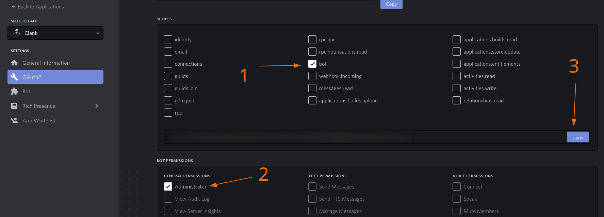

# :mailbox: Epitech Discord Bot Workshop - Part 00
## :+1: Some useful links

 What | Link
------|------
**Discord Developer Portal**|https://discordapp.com/developers
**discord.py Github**|https://github.com/Rapptz/discord.py
**discord.py Documentation**|https://discordpy.readthedocs.io/en/latest/index.html

## :hammer_and_wrench: Install and Setup
### :arrow_down: Dev tools installation

For developing a Discord bot with python, you need python3 (duh), pip and [discord.py](https://github.com/Rapptz/discord.py).  
To install these bad boys, you can use the following commands:

```bash
# python3 and pip, if not installed already
sudo dnf install python3 python3-pip

# python dependency, system wide
sudo python3 -m pip install "discord.py[voice]" youtube_dl
# python dependency, for your user only
python3 -m pip install --user "discord.py[voice]" youtube_dl

## The [voice] extra and youtube_dl are optional for now, but we will need them for part 03.
```

*If you don't use Fedora, you can figure out how to get python3 and pip.*

### :envelope: Invitation

**We recommand that your create yourself a Discord server dedicated to bot testing.**

  
On your bot's page, in the `OAuth2` category, select the `bot` scope and the `Administrator` permissions. Then copy paste the suggested link into your browser in order to invite the bot on your server.

*Of course, if you want to release your bot to the public, you would just select the permissions you need. But for development purpose, it's easier to have full power.* :)

### :gear: Run

* Create a `main.py` file, that will be our bot's entry point.  
You can now try to run some discord.py examples from the official repository to see if everything is working! ;)

---

*By Maxime Houis and Benjamin Praud*
