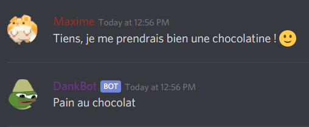
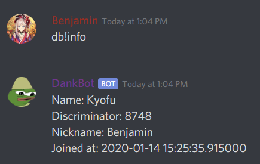
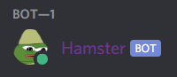
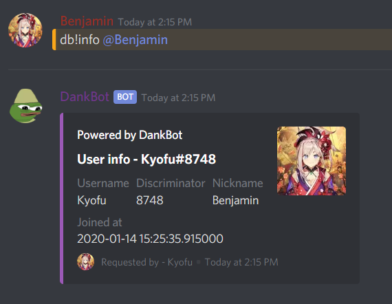

# :mailbox: Epitech Discord Bot Workshop - Part 01
## :+1: Some useful links

 What | Link
------|------
**Discord Developer Portal**|https://discordapp.com/developers
**discord.py Github**|https://github.com/Rapptz/discord.py
**discord.py Documentation**|https://discordpy.readthedocs.io/en/latest/index.html

---

## :pencil: Let's start at the beginning
### :calendar: Event handling

When anything happens on a Discord server, a corresponding event is triggered. There are currently half a hundred different types of events. You have, for example, events for when a user joins the server, when someone sends a message, when the bot loses connection, and many more.  
You can find the full list of Discord events [here](https://discordpy.readthedocs.io/en/latest/api.html#event-reference).

1) When the bot logs in, print a greetings message to the console.
2) When the bot disconnects, print a goodbye message to the console.
3) Make the bot answer `pain au chocolat` if anyone's message contains `chocolatine` (case insensitive).

4) When a user changes his nickname, annouce it by sending a message on the channel of your choice.
   * Example message: `Joffrey changed his nickname to SmileDealer!`

### :eyes: Discord presence

Your Discord presence contains your online status (online, away, busy, invisible), an activity (Playing XXX, Listening to XXX, Streaming, Custom Message, ...) and an AFK status.

When the bot logs in:
1) Change the bot's activity to a custom message of your choice.
1) Change the bot's status to "do not disturb".  
    *Once done, you can change it back to whatever you want.*

### :clipboard: Commands

discord.py makes our lives easier by providing an easy way to create commands. We can assign aliases, permissions, descriptions and much more.

1) Assign a command prefix of your choice. (we will use `db!` for the examples)
    * It is possible to have a multi-character command prefix!
    * `J,cM!K>4` is a valid command prefix! (*but let's be honest, it's really bad ...*)
1) Create a `db!ping` command that answers "pong".
1) Create a `db!info` command that answers some informations about the caller:
    * Username
    * Discriminator (this is the #0000 part)
    * Display name (user's current server nickname, if any)
    * User account creation date

1) Create a `db!stop` command that stops the bot and that is **only usable by the server admins**.
1) Create a `db!nick` command that changes the bot's nickname to what's been passed as parameters.
    * Example: `db!nick Hamster` renames the bot `Hamster` :)
    * If no argument is given, it resets the bot's nickname.
    

### :paperclip: Embeds

Responding in raw messages can be hard to read when the messages traffic is important (like `db!info` above). You can make them prettier and easier to read by using **embeds**!

1) Create a basic Embed and set the differents options:
    * Title
    * Color
    * Author
    * Footer
    * Thumbnail
1) Create and add two fields of your choice to your Embed
1) Now that you have an idea of how to use it, let's recreate the `db!info` command but with an Embed this time. Adding a user as a parameter can be a good addition to the command too.

*See? That's much better!*

---

*By Maxime Houis and Benjamin Praud*
